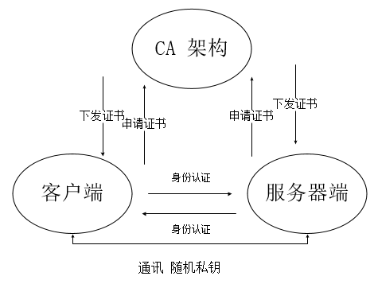
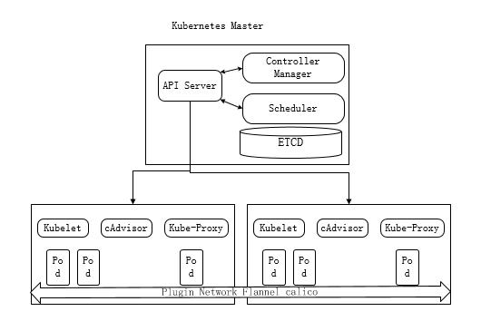
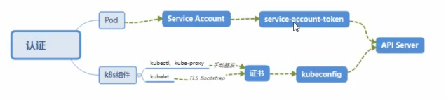

#### 机制说明

**kubernetes作为一个分布式集群的管理工具，保证集群的安全性是其一个中药的任务。API Server是建群内部各个组件通信的中介，也是外部控制的入口。所以kubernetes的安全机制基本就是围绕保护API Server来设计的。kubernetes使用了认证(Authentication)、鉴权(Authorization)、准入控制(Admission Control)三步来保证API Server的安全**

#### Authentication

* **HTTP Token认证： 通过一个Token来识别合法用户**
  * HTTP Token的认证是用一个很长的特殊编码方式的并且难以被模仿的字符串-Token来表达客户的一种方式。Token是一个很长的很复杂的字符串，每一个Token对应一个用户名存储在API Server能访问的文件中。当客户端发起API调用请求时，需要在HTTP Header里放入Token
* HTTP Base认证：通过 用户名+密码 的方式认证
  * 用户名+:+密码 用BASE64算法进行编程后的字符串放在HTTP Request中的Heather Authorization域里发送给服务端，服务端收到后进行编码，获取用户名及密码
* 最严格的HTTPS证书认证：基于CA根证书签名的客户端身份认证方式




节点认证



##### 两种类型

* Kubernetes 组件对API Server的访问: kubectl、Controller Manager、Scheduler、kubelet、kube-proxy
* kubernetes管理的pod对容器的访问: Pod (dashboard也是以pod形式运行)

##### 安全性说明

* **Controller Manager、Scheduler与API Server在同一台机器，所以直接使用API Server的非安全端口访问, `--insecure-bind-address=127.0.0.1`**
* kubectl、kubelet、kube-proxy访问API Server都需要证书进行HTTPS双向认证

##### 证书颁发

* 手动签发: 通过k8s集群的根ca进行签发HTTPS证书
* 自动签发：kubelet首次访问API Server时，使用token做认证，通过后，Controller Manager会为kubelet生成一个证书，以后都是用证书做认证了

##### kubeconfig

kubeconfig文件包含集群参数(CA证书、API Server地址 )，客户端参数(上面生成的证书和私钥)，集群context信息(集群名称、用户名)。Kubernetes组件通过启动时指定不同的kubeconfig文件可以切换到不同的集群

##### ServiceAccount

Pod中的容器访问API Server。因为Pod的创建、销毁是动态的，所以腰围它手动生成证书就不可行了、kubernetes使用了service Account解决Pod访问APIServer的认证问题

##### Secret与SA的关系

kubernetes设计了一种资源对象叫做Secret，分为两类，一种是用于ServiceAccount的service-account-token，另一种是用于保存用户自定义保密信息的Opaque。ServiceAccount中用到包含三个部分:Token、ca.crt、namespace

* token是使用API Server私钥签名的JWT。用于访问APIServer时，Server端认证
* ca.crt根证书。用于client端验证API Server发送的证书
* namespace,表示这个service-account-token的作用域命名空间

<!-- Json web token(JWT)，是为了在网络应用环境间传递声明而执行的一种基于JSON的开放标准([RFC 7519])，该token被设计为紧凑且安全的，特别适用于分布式站点的单点登录(SSO)场景。JWT的声明一般被用来在身份提供者和服务提供者建传递被认证的用户身份信息，以便于从资源服务器获取资源，也可以增加一些额外的其他业务逻辑所必须的声明信息，该token也可直接被用于认证，也可被加密 -->

```yaml
kubectl get secret --all-namespaces
kubectl describe secret default-token-5gm9r --namespace=kube-system
```

默认情况下，每个namespace都会有一个ServiceAccount，如果Pod在创建时没有指定ServiceAccount，就会使用Pod所属的namespace的ServiceAccount

<!--默认挂载目录: /run/secrets/kubernetes.io/serviceaccount/-->

##### 总结



